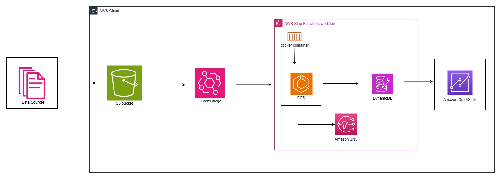

# Real-Time Event-Driven Data Pipeline for an E-Commerce Shop

## Table of Contents
1. [Project Overview](#project-overview)
2. [System Architecture](#system-architecture)
3. [Pipeline Workflow](#pipeline-workflow)
4. [Key Components](#key-components)
   - [Amazon S3](#amazon-s3)
   - [Amazon EventBridge](#amazon-eventbridge)
   - [AWS Step Functions](#aws-step-functions)
   - [Amazon ECS Tasks](#amazon-ecs-tasks)
   - [Amazon DynamoDB](#amazon-dynamodb)
   - [CloudWatch Logs & Monitoring](#cloudwatch-logs--monitoring)
5. [KPIs Computed](#kpis-computed)
   - [Category-Level KPIs](#category-level-kpis)
   - [Order-Level KPIs](#order-level-kpis)
6. [Setup Instructions](#setup-instructions)
7. [Error Handling](#error-handling)
8. [Monitoring & Alerts](#monitoring--alerts)
9. [Future Enhancements](#future-enhancements)

---

## Project Overview

This project implements a **real-time, event-driven data pipeline** for an e-commerce platform to support operational analytics. The pipeline processes transactional data (orders, products, etc.) arriving in flat-file format into an Amazon S3 bucket. The system validates, transforms, and computes business KPIs from the data, storing the results in Amazon DynamoDB for real-time querying.

The solution leverages **AWS-native services** in a containerized setup to ensure scalability, reliability, and automation.

---

## System Architecture

The architecture is designed to handle end-to-end processing of incoming data files. Below is a high-level overview:

1. **Data Ingestion**: Files are uploaded to an Amazon S3 bucket.
2. **Event Triggering**: Amazon EventBridge listens for new object creation events in the S3 bucket.
3. **Orchestration**: AWS Step Functions orchestrate the workflow by triggering two ECS tasks:
   - **Validation Task**: Validates and cleans the data.
   - **Transformation Task**: Computes KPIs and writes results to DynamoDB.
4. **Storage**: Cleaned data is stored in a separate S3 bucket, and computed KPIs are written to DynamoDB tables.
5. **Logging & Monitoring**: CloudWatch Logs track task execution and provide error alerts.
6. **Dashboarding**: Amazon QuickSight for real-time visualization of KPIs and operational metrics, including:
    - Interactive dashboards for business users
    - Custom visualizations for trend analysis

    

---

## Pipeline Workflow

1. **File Upload**: A flat file containing transactional data is uploaded to the designated S3 bucket.
2. **EventBridge Rule**: An EventBridge rule detects the file upload event and triggers the Step Function.
3. **Step Function Execution**:
   - **Validation Task**: The first ECS task reads the file, validates its structure, and performs data cleaning. If errors are found, the pipeline exits gracefully.
   - **Transformation Task**: The second ECS task processes the cleaned data, computes KPIs, and stores the results in DynamoDB.
4. **Data Storage**:
   - Validated and cleaned data is written to a separate S3 bucket.
   - Computed KPIs are stored in DynamoDB tables.
5. **Monitoring**: CloudWatch logs capture task execution details and generate alerts for failures.

---

## Key Components

### Amazon S3
- **Input Bucket**: Stores raw transactional data files.
- **Output Bucket**: Stores validated and cleaned data files.
- Files are processed and moved between buckets as part of the pipeline.

### Amazon EventBridge
- Listens for S3 object creation events (`s3:ObjectCreated:*`).
- Triggers the Step Function upon detecting a new file.

### AWS Step Functions
- Orchestrates the ECS tasks.
- Implements failure paths, branching logic, and timeouts for robust error handling.

### Amazon ECS Tasks
- **Validation Task**:
  - Reads raw data from the S3 input bucket.
  - Validates and cleans the data.
  - Writes cleaned data to the S3 output bucket.
- **Transformation Task**:
  - Reads cleaned data from the S3 output bucket.
  - Computes business KPIs.
  - Writes results to DynamoDB tables.

### Amazon DynamoDB
- **KPI Tables**:
  - Optimized for querying KPIs using partition keys, sort keys, and secondary indexes.
  - Example: `OrdersKPI` table with `OrderDate` as the partition key and `ProductID` as the sort key.

### CloudWatch Logs & Monitoring
- Tracks ECS task execution and logs errors.
- Generates alerts for pipeline failures or anomalies.

---
## KPIs Computed

The pipeline computes two types of KPIs to support operational analytics for the e-commerce platform. These KPIs are stored in Amazon DynamoDB tables, optimized for efficient querying.

### Category-Level KPIs (Per Category, Per Day)

These KPIs provide insights into the performance of individual product categories on a daily basis. The attributes include:

| **Attribute**         | **Description**                                                                 |
|------------------------|---------------------------------------------------------------------------------|
| `category`            | Product category (e.g., Electronics, Apparel).                                  |
| `order_date`          | Date of the summarized orders.                                                 |
| `daily_revenue`       | Total revenue generated from that category for the day.                        |
| `avg_order_value`     | Average value of individual orders in the category.                            |
| `avg_return_rate`     | Percentage of returned orders for the category.                                |

### Order-Level KPIs (Per Day)

These KPIs summarize the overall performance of orders placed on the platform on a daily basis. The attributes include:

| **Attribute**         | **Description**                                                                 |
|------------------------|---------------------------------------------------------------------------------|
| `order_date`          | Date of the summarized orders.                                                 |
| `total_orders`        | Count of unique orders placed on the platform.                                 |
| `total_revenue`       | Total revenue generated from all orders.                                       |
| `total_items_sold`    | Total number of items sold across all orders.                                  |
| `return_rate`         | Percentage of orders that were returned.                                       |
| `unique_customers`    | Number of distinct customers who placed orders.                                |

---

    

## Step Function Workflow

The AWS Step Function orchestrates the entire pipeline workflow, ensuring seamless execution of tasks while handling errors and cleanup. Below is a breakdown of each step in the state machine:

### 1. **CreateCluster**
- **Purpose**: Creates an ECS cluster to run the tasks.
- **Details**:
  - Creates a temporary ECS cluster named `ecs-ephemeral-cluster-123456`.
  - If the cluster creation fails, it transitions to `NotifyGeneralFailure`.

### 2. **RegisterTaskDefinition1**
- **Purpose**: Registers the task definition for the **Validation Task**.
- **Details**:
  - Registers a task definition (`ecs-pipeline-clean-task-123456`) for the first ECS task.
  - Configures the container with the necessary image, CPU, memory, and IAM roles.
  - If registration fails, it transitions to `DeleteCluster` for cleanup.

### 3. **RunTask1**
- **Purpose**: Executes the **Validation Task**.
- **Details**:
  - Runs the validation task on Fargate using the registered task definition.
  - Passes environment variables such as `LANDING_S3_BUCKET_URI` and `CLEANED_S3_BUCKET_URI` to the container.
  - If the task fails, it transitions to `DeregisterTaskDefinition1` for cleanup.

### 4. **ExtractTask1Status**
- **Purpose**: Extracts the success status of **Task1**.
- **Details**:
  - Marks **Task1** as successful and proceeds to register the second task definition.

### 5. **RegisterTaskDefinition2**
- **Purpose**: Registers the task definition for the **Transformation Task**.
- **Details**:
  - Registers a task definition (`ecs-pipeline-kpis-task-123456`) for the second ECS task.
  - Configures the container with the necessary image, CPU, memory, and IAM roles.
  - If registration fails, it transitions to `DeregisterTaskDefinition1` for cleanup.

### 6. **RunTask2**
- **Purpose**: Executes the **Transformation Task**.
- **Details**:
  - Runs the transformation task on Fargate using the registered task definition.
  - Passes environment variables such as `CLEANED_S3_BUCKET_URI`, `CATEGORY_KPI_DYNAMODB_TABLE`, and `ORDER_KPI_DYNAMODB_TABLE` to the container.
  - If the task fails, it transitions to `CleanupBothTaskDefinitions` for cleanup.

### 7. **ExtractTask2Status**
- **Purpose**: Extracts the success status of **Task2**.
- **Details**:
  - Marks **Task2** as successful and proceeds to clean up both task definitions.

### 8. **CleanupBothTaskDefinitions**
- **Purpose**: Deregisters both task definitions in parallel.
- **Details**:
  - Deregisters `ecs-pipeline-clean-task-123456` and `ecs-pipeline-kpis-task-123456` in parallel.
  - Ignores errors during deregistration and proceeds to delete the ECS cluster.

### 9. **DeleteCluster**
- **Purpose**: Deletes the temporary ECS cluster.
- **Details**:
  - Deletes the ECS cluster created at the beginning of the workflow.
  - If deletion fails, it transitions to `NotifyCleanupFailure`.

### 10. **NotifySuccess**
- **Purpose**: Notifies stakeholders of a successful execution.
- **Details**:
  - Sends an SNS notification with the subject "Step Function SUCCESS" and details of the execution.
  - Ends the workflow successfully.

### Error Handling States
- **NotifyGeneralFailure**:
  - Sends an SNS notification with the subject "Step Function FAILURE" if any step fails.
  - Transitions to `WorkflowFailed` to terminate the workflow.

- **NotifyCleanupFailure**:
  - Sends an SNS notification with the subject "Cleanup Failure" if resource cleanup fails.
  - Ends the workflow without further action.

- **WorkflowFailed**:
  - Marks the workflow as failed and terminates execution.

---
## Setup Instructions

### Prerequisites
- AWS CLI installed and configured.
- Docker installed for containerization.
- IAM roles and permissions set up for S3, ECS, EventBridge, Step Functions, DynamoDB, and CloudWatch.

### Steps
1. **Create S3 Buckets**:
   - Create an input bucket for raw data.
   - Create an output bucket for cleaned data.
2. **Set Up EventBridge Rule**:
   - Configure an EventBridge rule to listen for `s3:ObjectCreated:*` events in the input bucket.
   - Set the target as the Step Function state machine.
3. **Deploy ECS Tasks**:
   - Build Docker images for the validation and transformation tasks.
   - Push the images to Amazon Elastic Container Registry (ECR).
   - Create ECS task definitions and services.
4. **Configure Step Functions**:
   - Define a state machine to orchestrate the ECS tasks.
   - Add error handling, retries, and timeouts.
5. **Set Up DynamoDB Tables**:
   - Create tables for storing KPIs.
   - Define partition keys, sort keys, and secondary indexes.
6. **Enable CloudWatch Logging**:
   - Configure logging for ECS tasks and Step Functions.
   - Set up alerts for critical errors.

---

## Error Handling

- **Validation Task**:
  - Rejects malformed or incomplete data.
  - Logs errors to CloudWatch and exits the pipeline gracefully.
- **Transformation Task**:
  - Handles errors during KPI computation.
  - Logs detailed error messages for debugging.
- **Step Functions**:
  - Implements retry policies and fallback mechanisms.
  - Sends notifications for unresolved failures.

---

## Monitoring & Alerts

- **CloudWatch Metrics**:
  - Track ECS task success/failure rates.
  - Monitor Step Function execution times.
- **CloudWatch Alarms**:
  - Generate alerts for pipeline failures or delays.
- **Log Analysis**:
  - Use CloudWatch Logs Insights to analyze task execution logs.

